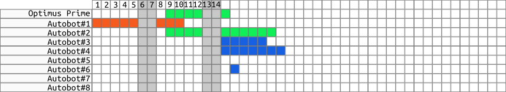

#   Time Table

This document provides general description and implementation details for
the `App.Views.TimeTable` application.

##  Description
The `App.Views.TimeTable` application should provide information regarding
team vacation requests. This information should be presented
as a time table of vacations.

The application should show members of selected team along with time table.

The application should provide HTML controls to select the following:
  - team, [**to be decided**]
  - view type.

The application should provide HTML control to render vacations time table
for members of selected team in a manner and style that are determined
by a view type.

The following view types should be supported:
  - by day, see *Figure 1*
  - by week,
  - by month.

*Figure 1. View by day*

##  Implementation
The application should be implemented as `App.Views.TimeTable`,
a view to represent a *time table of vacations*
provided by following views:
  - `App.Views.TimeTableByDay`
  - `App.Views.TimeTableByWeek`
  - `App.Views.TimeTableByMonth`

The application should render appropriate view from the list above
depending on selected view type.

The application should be used by `App.Views.Dashboard`.

### Prerequisites
The view requires template to represent the following:
  - HTML controls to provide ability to select a *team* [**to be decided**] and a *view type*
  - Placeholder for appropriate *time table* view

The view requires the following information:
  - *team ID*, to fill template with vacation requests data [**to be decided**]
  - *list of team users*, to fill template with list of users
  - *list of vacation requests per team member*, to generate time table

### Implementation Proposal
The following should be implemented within Backbone application:
  - Add `App.Views.TimeTable`
  - Add `App.Views.TimeTableByDay`, to present time table by day
  - Add `App.Views.TimeTableByWeek`, to present time table by week
  - Add `App.Views.TimeTableByMonth`, to present time table by month
  - Add `App.Collections.TeamMembers`, to provide a list of team members

The following should be implemented within Rails application:
  - Add `TeamsController#members` to provide list of team members
  - Update routes to dispatch `team_members/:team_id`.
  - Add `TeamsController#vacations` to provide list of vacations of team members
  - Update routes to dispatch `team_vacations/:team_id`.

##  Questions
The following should be discussed:
  - How to render time table for each type of view?
  - Which period of time to be displayed?

##  Estimations
The following table represents approximations on time needed for implementation:

| Feature                       | Planned hours | Actual hours  | Status      |
| :---------------------------- | :-----------: | :-----------: | :---------- |
| `App.Views.TimeTable`         | 3             | 3             | *in progress* |
| `TeamsController#members`     | 2             | 1             | *done* |
| `TeamsController#vacations`   | 1             | 3             | *done* |
